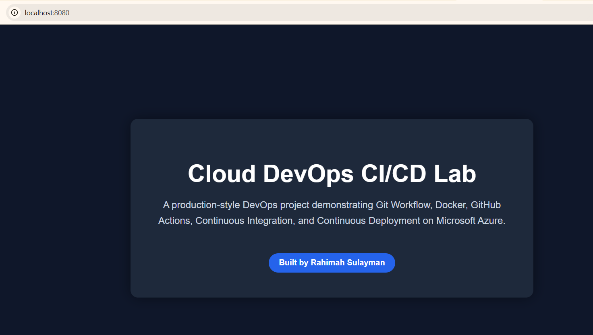
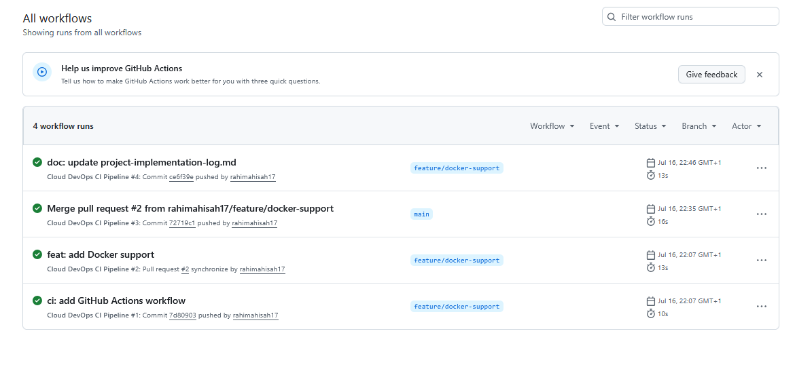
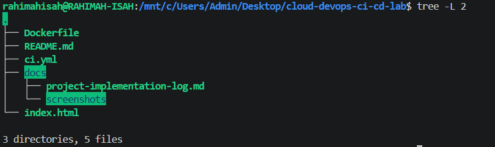

# Cloud DevOps CI/CD Lab

A hands-on DevOps project demonstrating a production-inspired Git workflow using feature branches, pull requests, Docker, and GitHub Actions to implement Continuous Integration and Continuous Delivery (CI/CD).

## Project Overview

This project simulates a collaborative software delivery workflow commonly used by DevOps teams. It follows the lifecycle of a feature from issue creation and development through pull requests, automated builds, containerization, and successful integration into the main branch.

The project emphasizes Git best practices, automation, Docker-based application delivery, and GitHub Actions workflows.

## Project Preview

### Local Application



### GitHub Actions Pipeline



### Final Project Structure



## Technologies Used

- Git
- GitHub
- GitHub Actions
- Docker
- Nginx
- Linux (WSL)
- Visual Studio Code
- Markdown

## Project Structure

```text
.
├── .github/
│   └── workflows/
├── docs/
│   ├── project-implementation-log.md
│   └── screenshots/
├── Dockerfile
├── index.html
├── README.md
└── .gitignore
```

## CI/CD Workflow

This project implements a GitHub Actions pipeline that automatically validates and builds the application whenever changes are pushed or a pull request is opened.

```text
GitHub Issue
      │
      ▼
Feature Branch
      │
      ▼
Development
      │
      ▼
Commit
      │
      ▼
Push
      │
      ▼
Pull Request
      │
      ▼
GitHub Actions
      │
      ▼
Build Docker Image
      │
      ▼
Publish Docker Image (GHCR)
```

## Key Features

- GitHub Issues for task tracking
- Feature branch workflow
- Pull request-based development
- Docker containerization with Nginx
- Automated Continuous Integration using GitHub Actions
- Continuous Delivery pipeline for Docker images
- Comprehensive implementation documentation
- Professional Git workflow from development to merge

## Documentation

Detailed implementation steps, commands, screenshots, and progress are documented in:

- `docs/project-implementation-log.md`

The implementation log captures the complete development lifecycle, from repository setup and Git workflow to Docker containerization, CI/CD pipeline implementation, troubleshooting, and final integration.

## Screenshots

The project includes screenshots documenting each major implementation milestone, including:

- Repository setup
- Git workflow
- Docker image build
- Local container execution
- GitHub Actions workflow
- Pull request creation
- Successful CI/CD pipeline
- Project structure

> Screenshots are available in `docs/screenshots/`.

## Future Enhancements

Potential improvements for this project include:

- Deploying the Docker image to Azure Container Apps or Kubernetes
- Adding automated security and vulnerability scanning
- Implementing Infrastructure as Code (Terraform or Bicep)
- Adding automated application testing to the pipeline
- Supporting multiple deployment environments (Development, Staging, and Production)

## Conclusion

This project demonstrates a practical DevOps workflow using modern development and automation practices. It showcases version control with Git, collaborative development through feature branches and pull requests, containerization with Docker, and automated Continuous Integration and Continuous Delivery using GitHub Actions.

By documenting each implementation step, the repository provides a reproducible reference for building and maintaining a CI/CD pipeline in a real-world development environment.


